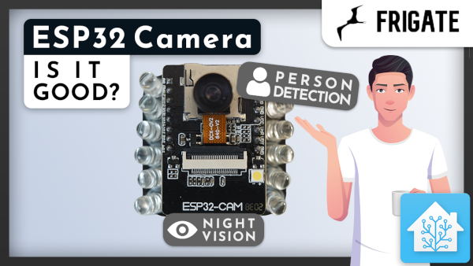
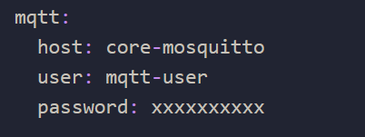
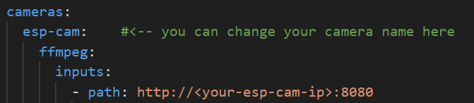

# Integrating ESP32 Camera with ESPHome and Frigate: Project guide 📸🔧

This is a comprehensive project guide on the integration of an ESP32 camera with ESPHome and Frigate. This repository illustrates a step-by-step walkthrough on how to connect an ESP32 camera module to Frigate.
The `esphome-config.yaml` file provided within this repository is specifically curated for an Ai-Thinker ESP32-CAM, but don't worry, if you have a different board model you can easily edit it to suit your needs.

## Prerequisites and necessary tools ⚙️

Before diving into the actual process, please ensure you have the following installations:

- **ESPHome** 

- **Frigate** 

Notably, if you are already running a Home Assistant server, these platforms can be readily installed from the [Add-ons Store Page](https://my.home-assistant.io/redirect/supervisor).

## Firmware Compilation with ESPHome 📚➡️🔧

1. **Add a New Device:** Start by adding a new device from your ESPHome dashboard.

    

2. **Configuration Replacement:** Proceed by replacing all the contents of your configuration file with the [`esphome-config.yaml`](https://github.com/fabio-garavini/ESP32-Cam-Frigate/esphome-config.yaml).

3. **Save and Upload:** After successfully replacing the contents, click on 'Save and upload' your file. (with your esp-cam connected to your computer)

4. **Wifi Credential Setup:**
    - Connect to the esp camera wifi ap from your phone or computer

    - Open this page [http://192.168.4.1](http://192.168.4.1)

        

    - Select your wifi network and type your password

## Frigate Configuration ⛴️

1. **Find the IP Address:** Start by finding your ESP32 camera's ip address.
    - You can do it from your phone by using [Fing](https://play.google.com/store/apps/details?id=com.overlook.android.fing) or [Wifiman](https://play.google.com/store/apps/details?id=com.ubnt.usurvey)

2. **Frigate Config:** Proceed with the addition of the contents from this repository to your [`frigate.yaml`](https://github.com/fabio-garavini/ESP32-Cam-Frigate/frigate.yaml) config file.

3. **MQTT Server:** If you haven't already make sure to add your MQTT server information on your [`frigate.yaml`](https://github.com/fabio-garavini/ESP32-Cam-Frigate/frigate.yaml) file

    

4. **Camera Config:** Replace the sample ESP-CAM ip address with your's.

    

5. **Restart:** Restart Frigate to load the changes.

By this step, you should have a fully functional ESP32 camera integrated with Frigate and ESPHome.
Happy tinker! 🎉🚀
